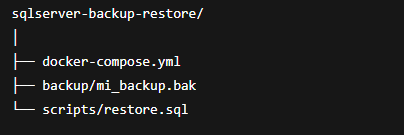

## Create a Sql Server Container with volunes, without a SSL Certificate and from a backup with Docker Compose 


create a folder where you put the *.bak* file, docker-compose.yml and a script folder as follows:



Create the following *docker-compose.yml* to prepare de sqlserver container:

```yml
services:
  sqlserverv2:
    image: mcr.microsoft.com/mssql/server:2022-latest
    container_name: sqlserverv2
    environment:
      SA_PASSWORD: "YourStrong@Passw0rd"
      ACCEPT_EULA: "Y"
    ports:
      - "1433:1433"
    volumes:
      - ./backup:/var/opt/mssql/backup
      - ./scripts:/scripts
      - sqlserver_data:/var/opt/mssql/data
    command: /bin/bash /scripts/entrypoint.sh
```

in the volumes property we set 3 lines:

* ./backup:/var/opt/mssql/backup
path where we have the backup of the database and then the path where we'll move the db in the container

* ./scripts:/scripts
in this folder we have the entrypoint.sh and the restore.sql file. these file are in charge of handle the restore of the database in the container

* sqlserver_data:/var/opt/mssql/data
this line setup the volume in the container

the **command** property run a command when the docker-compose is executed

#### restore.sql

Now inside the restore.sql we have the script to restore the database
```sql
USE master;
GO

-- Terminar conexiones existentes (si es necesario)
ALTER DATABASE MiBaseDeDatos SET SINGLE_USER WITH ROLLBACK IMMEDIATE;
GO

-- Restaurar la base de datos
RESTORE DATABASE MiBaseDeDatos
FROM DISK = '/var/opt/mssql/backup/mi_backup.bak'
WITH 
    MOVE 'MiBaseDeDatos_Data' TO '/var/opt/mssql/data/MiBaseDeDatos.mdf',
    MOVE 'MiBaseDeDatos_Log' TO '/var/opt/mssql/data/MiBaseDeDatos_log.ldf',
    REPLACE;
GO

-- Volver a multiusuario
ALTER DATABASE MiBaseDeDatos SET MULTI_USER;
GO
```

#### entrypoint.sh

and now configure the entrypoint.sh file to run the restoration:

```sh
#!/bin/bash

echo "Iniciando SQL Server..."
/opt/mssql/bin/sqlservr &

echo "Esperando a que SQL Server esté listo para conexiones..."
sleep 30

echo "Restaurando la base de datos desde el backup..."
/opt/mssql-tools/bin/sqlcmd -S localhost -U SA -P 'YourStrong@Passw0rd' -i /scripts/restore.sql

echo "Restauración completada. El contenedor seguirá corriendo."
# Espera indefinidamente para mantener el contenedor vivo
wait
```
create this file inside **scripts** folder

* *IMPORTANT* keep in mind that the sql server container requieres a SSL certificate after the ODBC Driver 18 version, so that you need to run the following command if you are in a Development environment and you don't need validate this certificate

```docker
/opt/mssql-tools18/bin/sqlcmd -S localhost -U SA -P 'YourStrong@Passw0rd' -C -i /scripts/restore.sql
```

the -C parameter overturn the certificate validation. *this is only recomended for development*

if you are in a production enviroment, remove the -C parameter from the command

And finally create the container:

```docker
docker-compose up --build
```

